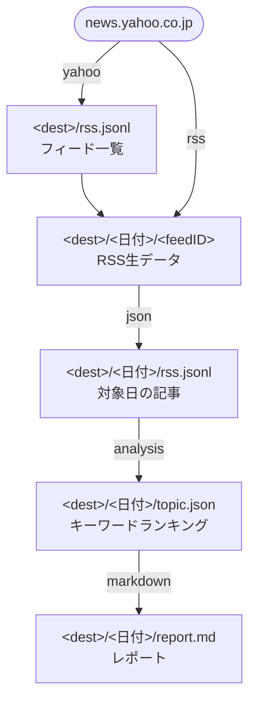

# yahoo-news-keyword-ranking

[](https://github.com/ohnishi/yahoo-news-keyword-ranking/actions/workflows/ci.yml)

Yahoo!ニュースの記事タイトルに登場するキーワードを形態素解析によって抽出して、ランク付けします。

その日のRSSを一通り集め、記事タイトルから人名を取り出し、多くの記事で言及された順に
並べた Markdown のレポートを生成します。

> **本ツールは Yahoo! JAPAN とは無関係の、非公式な個人プロジェクトです。**
> 一般に公開されている RSS フィードのみを利用しています。
> Yahoo! および Yahoo!ニュースは、各権利者の登録商標です。

## 生成されるもの

`<dest>/<YYYYmmdd>/report.md` に、静的サイトジェネレータで扱える front matter 付きの
Markdown が出力されます。

```markdown
---
title: "2020/12/18 に話題になったキーワードランキング"
date: 2020-12-18T00:00:00+09:00
---

### 1位 山田太郎 （3記事）
- [【速報】山田太郎 が 受賞（写真）](https://example.com/1)
- [山田太郎 と 鈴木一郎 が 対談](https://example.com/2)
- [山田太郎 の 記者会見](https://example.com/4)

### 2位 佐藤花子 （1記事）
- [佐藤花子 が 新記録](https://example.com/3)
```

## 仕組み

5つの段からなるパイプラインで、各段はファイルを介して繋がっています。
途中の成果物がすべて残るので、任意の段からやり直せます。



出力ディレクトリはこのような構造になります。

```
~/Desktop/analysis/
├── rss.jsonl                        # フィード一覧（日付をまたいで再利用）
└── 20201218/
    ├── rss/
    │   ├── media/example            # 取得したRSSの生データ
    │   └── categories/domestic
    ├── rss.jsonl                    # 対象日の記事一覧
    ├── topic.json                   # キーワードランキング
    └── report.md                    # 最終成果物
```

> `rss.jsonl` という名前が2箇所に出てきますが、
> ルート直下のものは**フィード一覧**、日付ディレクトリ配下のものは**抽出した記事一覧**で、
> 中身は別物です。

## 必要環境

| | |
| --- | --- |
| Go | 1.25 以上 |
| MeCab | 本体とヘッダ（cgo でリンクします） |
| 辞書 | mecab-ipadic-NEologd |

### MeCab のインストール

```bash
# macOS
brew install mecab mecab-ipadic

# Debian / Ubuntu
sudo apt-get install -y mecab libmecab-dev mecab-ipadic-utf8
```

`libmecab` のヘッダ (`mecab.h`) が無いとビルド時に次のエラーになります。

```
fatal error: 'mecab.h' file not found
```

### 辞書のインストール

新語・固有名詞に強い mecab-ipadic-NEologd を使います。導入手順は本家を参照してください。

https://github.com/neologd/mecab-ipadic-neologd/blob/master/README.ja.md

辞書ディレクトリは以下の順で自動検出します。見つからない場合や別の場所に置いた場合は
`--dic` で明示的に指定してください。

1. `/opt/homebrew/lib/mecab/dic/mecab-ipadic-neologd` (Apple Silicon)
2. `/usr/local/lib/mecab/dic/mecab-ipadic-neologd` (Intel Mac / 手動ビルド)
3. `/usr/lib/mecab/dic/mecab-ipadic-neologd` (Debian/Ubuntu)
4. `/var/lib/mecab/dic/mecab-ipadic-neologd`

### ビルド

```bash
make build
```

カレントディレクトリに `wadai` が生成されます。
リポジトリ名とは別に、バイナリ名は短い `wadai`（話題）にしてあります。
変更する場合は `Makefile` の `BINARY` と `internal/cli/cli.go` の `Use` を書き換えてください。

## クイックスタート

パイプライン全体をまとめて実行する `run` が一番簡単です。

```bash
./wadai run --dest ~/Desktop/analysis
```

`--date` を付けずに実行すると、当日分をネットワークから取得してレポート生成まで通します。
`~/Desktop/analysis/<今日の日付>/report.md` が生成されます。

取得済みのデータを処理し直す場合は `--date` を指定します。
RSS は過去に遡って取得できないため、このときネットワークアクセスは行いません。

```bash
# 特定の日を処理し直す
./wadai run --src ~/Desktop/analysis --dest ~/Desktop/analysis --date 20201218

# 期間をまとめて処理する
./wadai run --src ~/Desktop/analysis --dest ~/Desktop/analysis --date 20201201,20201231
```

期間指定では1日ずつ処理し、ある日が失敗しても残りの日は処理を続けます。
失敗した日はまとめて最後に報告されます。

## コマンドリファレンス

`run` は以下の5コマンドを順に実行しているだけなので、個別に実行することもできます。

### `yahoo` — フィード一覧の取得

```bash
./wadai yahoo --dest ~/Desktop/analysis
```

RSS一覧ページをスクレイピングして `<dest>/rss.jsonl` に保存します。
フィード構成は頻繁には変わらないので、毎日実行する必要はありません。

### `rss` — RSSファイルの取得

```bash
./wadai rss --src ~/Desktop/analysis --dest ~/Desktop/analysis
```

`<src>/rss.jsonl` の各フィードを取得し、`<dest>/<日付>/<feedID>` に保存します。
一部のフィードが失敗しても残りは取得を続け、全滅した場合のみエラーになります。

RSS は現在の内容しか配信されないため、`--date` は取得内容ではなく**保存先ディレクトリ**を
決めるだけです（既定は当日）。

### `json` — 対象日の記事を抽出

```bash
./wadai json --src ~/Desktop/analysis --dest ~/Desktop/analysis --date 20201218
```

取得したRSSを解析し、対象日に公開された記事だけを `<dest>/<日付>/rss.jsonl` に抽出します。
複数のフィードに同じ記事が載っていた場合はURLで重複排除します。
壊れたRSSや当日のファイルが無いフィードは警告を出して読み飛ばします。

### `analysis` — キーワード抽出

```bash
./wadai analysis --src ~/Desktop/analysis --dest ~/Desktop/analysis --date 20201218
```

記事タイトルを形態素解析してキーワードを抽出し、`<dest>/<日付>/topic.json` に保存します。
抽出ルールは[後述](#キーワード抽出のルール)。

### `markdown` — レポート生成

```bash
./wadai markdown --src ~/Desktop/analysis --dest ~/Desktop/analysis --date 20201218
```

`topic.json` から `<dest>/<日付>/report.md` を生成します。
キーワードが1件も無い場合はエラーになります。

### `run` — 全段の一括実行

```bash
./wadai run --dest ~/Desktop/analysis
```

`--date` 未指定なら `yahoo` → `rss` → `json` → `analysis` → `markdown` を当日分に対して通します。
`--date` を指定した場合は取得の2段を飛ばし、`json` 以降だけを実行します。
`--fetch` を付けると `--date` 指定時でも取得段を実行します。

> `--date` 未指定（取得あり）のときは、取得したフィード一覧が `--dest` に書かれるため、
> 以降の入力も `--dest` になります。この場合 `--src` は使われません。

### フラグ一覧

| フラグ | 対象コマンド | 既定値 | 説明 |
| --- | --- | --- | --- |
| `--src` | `rss` `json` `analysis` `markdown` `run` | `~/Desktop` | 入力ディレクトリ。先頭の `~` は展開されます |
| `--dest` | 全て | `~/Desktop` | 出力ディレクトリ。同上 |
| `--date` | `rss` `json` `analysis` `markdown` `run` | — | 対象日 `20201218` または期間 `20201201,20201231`。`json` `analysis` `markdown` では必須 |
| `--top` | `analysis` `run` | `30` | 残すキーワード件数。`0` で全件 |
| `--dic` | `analysis` `run` | 自動検出 | MeCab の辞書ディレクトリ |
| `--max-attempts` | `yahoo` `rss` `run` | `3` | リクエストごとの試行回数（初回を含む総数） |
| `--timeout` | `yahoo` `rss` `run` | `30s` | リクエストごとのタイムアウト |
| `--fetch` | `run` | `false` | `--date` 指定時にも取得段を実行する |
| `--verbose` | 全て | `false` | デバッグログを出力する |

ログは標準エラーに出力されます。エラー終了時の終了コードは `1` です。
`Ctrl-C` で進行中の取得を中断できます。

## キーワード抽出のルール

### 抽出対象

MeCab の素性が **`名詞,固有名詞,人名,一般`** の形態素だけをキーワードとして採用します。
つまり抽出されるのは基本的に**人名**です。地名や組織名は対象外です。

対象を変えたい場合は [`internal/analyze/analyze.go`](internal/analyze/analyze.go) の
`Token.IsPersonName` を変更してください。

### タイトルの正規化

解析前に記事タイトルを整形します（[`internal/analyze/normalize.go`](internal/analyze/normalize.go)）。

| 処理 | 例 |
| --- | --- |
| 小文字化・前後の空白除去 | `NHK` → `nhk` |
| 先頭の見出しタグを除去 | `【速報】山田太郎が受賞` → `山田太郎が受賞` |
| 末尾の注記を除去 | `山田太郎が受賞（写真）` → `山田太郎が受賞` |
| 閉じ括弧を欠く括弧は以降を除去 | `山田太郎が受賞（写真` → `山田太郎が受賞` |
| ノイズ文字列を除去 | `:` `：` `にも` |

対象の括弧は `()` `（）` `[]` `【】` `〈〉` です。
文中にある閉じた括弧は本文の一部として残します（`山田太郎(29)が受賞` はそのまま）。

`にも` の除去は、NEologd 辞書が直前の語と結合して誤った固有名詞を切り出すことがあるための
回避策です。

なお、レポートに表示される記事タイトルは正規化前の**元のタイトル**です。

### 集計と並び順

- 同じタイトルに同じ語が複数回現れても、その記事は1回だけ数えます
- 記事数の降順、同数の場合は語の昇順で並べます
- `--top` 件（既定30件）で打ち切ります

並び順は入力が同じなら常に同じになります（`topic.json` と `rss.jsonl` の行順も同様）。
差分が取れるので、日次で回して結果を git 管理するといった使い方ができます。

## データ形式

中間ファイルはすべて JSON Lines（1行1JSONオブジェクト）です。

### `<dest>/rss.jsonl` — フィード一覧

```json
{"id":"rss/media/example","name":"サンプル通信","url":"https://news.yahoo.co.jp/rss/media/example.xml"}
{"id":"rss/categories/domestic","name":"国内","url":"https://news.yahoo.co.jp/rss/categories/domestic.xml"}
```

`id` はフィードURLのパスから導出され、RSS生データの保存パスとしても使われます。

### `<dest>/<日付>/rss.jsonl` — 対象日の記事

```json
{"date":"2020-12-18T10:00:00+09:00","url":"https://example.com/1","name":"サンプル通信","title":"【速報】山田太郎 が 受賞（写真）"}
{"date":"2020-12-18T12:00:00+09:00","url":"https://example.com/2","name":"サンプル通信","title":"山田太郎 と 鈴木一郎 が 対談"}
```

`name` は記事が載っていたフィードのタイトルです。

### `<dest>/<日付>/topic.json` — ランキング

```json
{
  "format_date": "2020/12/18",
  "date": "2020-12-18T00:00:00+09:00",
  "items": [
    {
      "word": "山田太郎",
      "count": 3,
      "articles": [
        {"title": "【速報】山田太郎 が 受賞（写真）", "url": "https://example.com/1"}
      ]
    }
  ]
}
```

実ファイルは1行にまとまっています（上記は読みやすさのために整形したもの）。
`count` は `articles` の件数と常に一致します。

## 日次で回す

`run` を1日1回叩くだけです。cron の例:

```cron
5 23 * * * /usr/local/bin/wadai run --dest $HOME/Desktop/analysis >> $HOME/Library/Logs/wadai.log 2>&1
```

その日のうちに実行してください。RSS は現在の内容しか配信されないため、
日付が変わってから実行すると当日分の記事を取りこぼします。

## トラブルシューティング

### `fatal error: 'mecab.h' file not found`

MeCab のヘッダが入っていません。[必要環境](#必要環境)のインストール手順を実行してください。
MeCab を使わない部分のテストだけなら `make test-pure` で実行できます。

### `mecab dictionary directory not found`

`--dic` に指定したパスが存在しません。パスを確認するか、
自動検出に任せる場合は `--dic` を外してください。
インストール済みの辞書の場所は次で確認できます。

```bash
mecab-config --dicdir
```

### キーワードが0件になる

`markdown` が `no keywords to report` で失敗する場合、その日の `topic.json` が空です。
`<dest>/<日付>/rss.jsonl` に記事が入っているか確認してください。

記事はあるのにキーワードが0件なら、NEologd 辞書が使われていない可能性が高いです。
既定辞書（ipadic）では人名の判定精度が落ちます。`--verbose` を付けると
使用中の辞書ディレクトリが確認できます。

### 記事が0件になる

`json` の段で `no articles found for date` が出る場合、そもそもRSSが取得できていないか、
対象日が取得日とずれています。`<dest>/<日付>/` にRSSの生データがあるか確認してください。

## 開発

### パッケージ構成

```
main.go                       エントリポイント
internal/
  model/                      各段が受け渡すデータ構造
  jsonl/                      JSON Lines の読み書き
  fsutil/                     パス展開とファイル生成
  daterange/                  --date の解釈
  fetch/                      RSSフィード一覧とRSSファイルの取得
  extract/                    RSS -> 記事JSON
  analyze/                    キーワード抽出とランク付け
    mecab/                    MeCab による Tokenizer 実装（cgo）
  report/                     Markdown レポート生成
  cli/                        cobra によるコマンド定義
```

形態素解析器は `analyze.Tokenizer` インタフェースの裏にあります。

```go
type Tokenizer interface {
	Tokenize(text string) ([]Token, error)
	Close() error
}
```

cgo に依存するのは `internal/analyze/mecab` だけなので、
解析ロジック本体は MeCab 無しでテストできます。
別の形態素解析器に差し替える場合もこのインタフェースを実装するだけです。

### タスク

```bash
make test        # 全パッケージ（MeCab のヘッダが必要）
make test-pure   # MeCab を必要としないパッケージのみ
make vet
make fmt         # gofmt -s を適用
make fmt-check   # gofmt 差分があれば失敗する
make build
make help        # ターゲット一覧
```

CI では `libmecab-dev` を入れたうえで、gofmt チェック・`go vet`・`go test -race`・
`go build` を実行しています（辞書はビルドに不要なので入れていません）。

## ライセンス

Apache License 2.0. [LICENSE](LICENSE) を参照してください。
